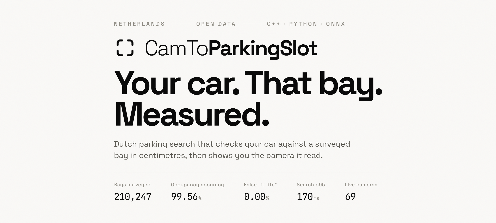

# CamToParkingSlot

### Every parking app tells you a space exists. This one draws your car in it.

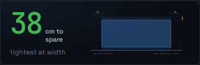

That is a real Amsterdam bay and a real Volvo S60, both at their published dimensions,
both from Dutch open data. The 36 cm is subtraction. Bay and car are drawn at one scale,
so the picture cannot flatter the fit.

Width is what is tight. The bay is 2.21 m, the S60 is 1.80 m across the bodywork, and a
parallel bay asks for 5 cm of lateral margin in total, which leaves 36 cm. Length is
nowhere near as close, at 54 cm clear off each end.

---

## Run it

```bat
run.bat
```

Double-click it, or type it in cmd, PowerShell or Git Bash. It checks what is missing,
installs `uv` if you do not have it, pulls the open data the first time, starts both
servers and opens the page. Running it twice is safe: every step checks whether it is
already done.

You need git, Node 20+ and ffmpeg on PATH first. Everything else it handles.

[Full instructions, including macOS and Linux](#running-it-the-long-way) are further down.

---

## What it does

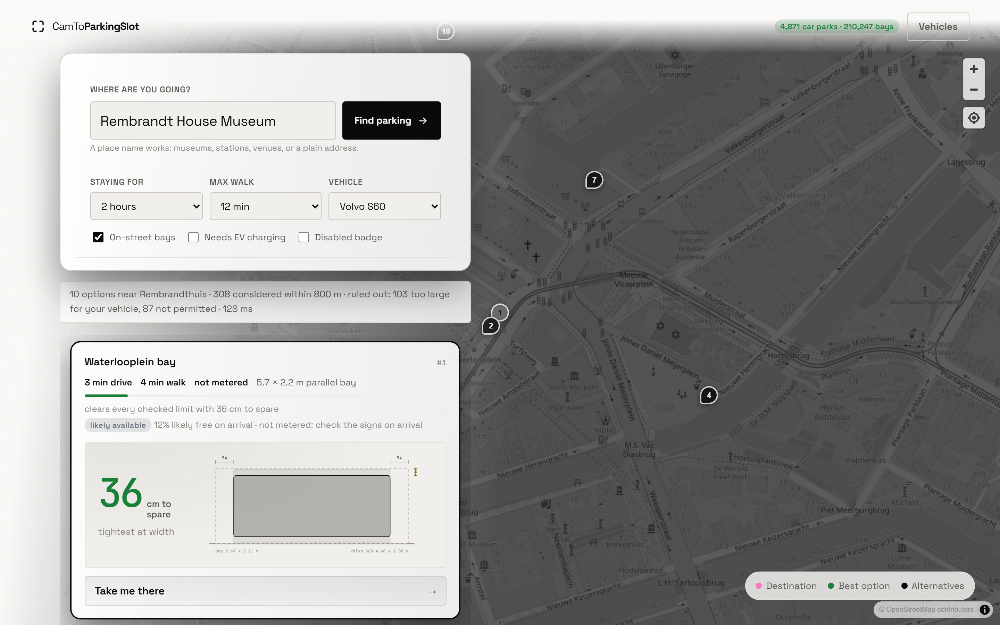

Type where you are going and pick which car you drive. Results are ranked by what parking
actually costs you, meaning drive time plus walk time plus price plus the chance the space
is gone when you arrive, and filtered to spaces the car fits.

The line under the search box reads "308 considered within 800 m, ruled out: 103 too large
for your vehicle, 87 not permitted". Switch to a Sprinter and the kerb bays vanish, because
a 5.7 m bay cannot take a 7 m van.

---

## Results

Measured with `pf evaluate`. Full output in `docs/architecture/evaluation.json`.

| | Measured | Target | |
|---|---:|---:|:--|
| False-free rate | **0.56 %** | ≤ 2 % | pass |
| Vacant precision | **99.13 %** | ≥ 98 % | pass |
| Vacant recall | **93.39 %** | ≥ 90 % | pass |
| False "it fits" rate | **0.00 %** | ≤ 2 % | pass |
| Gap-length MAE | **0.001 m** | ≤ 0.25 m | pass |
| Gap-length p95 error | **0.003 m** | ≤ 0.50 m | pass |
| Search latency p95 | **170 ms** | ≤ 500 ms | pass |

Over 3,000 fit trials, 4,000 frame samples, 60 rendered scenes and 12 search runs.

The one I watch is the false-free rate: how often the system says a space is free when it
is not. Accuracy on its own hides it. A detector that calls every space occupied scores
well on accuracy and is useless, and one that invents a free space now and then sends
someone across a city for nothing. 10 of 1,225 truly vacant trials came out wrong in the
unsafe direction.

---

## Is this bay free?

This is the computer vision that works, and it took me a long detour to arrive at the
right question.

I spent weeks trying to *find* vehicles in a street scene. That is the hard version of the
problem, and my detector generalised badly: precision 0.120 on cameras it had not seen.
Then it clicked that Amsterdam already publishes 210,247 bays as surveyed polygons, so
where every bay is was never unknown. Whether it currently has a car in it is, and that is
a per-crop binary question.

[CNRPark-EXT](http://cnrpark.it/) is exactly that question with 144,965 labelled answers:
real parking-space crops from nine fixed cameras over three months, under sunny, overcast
and rainy skies.

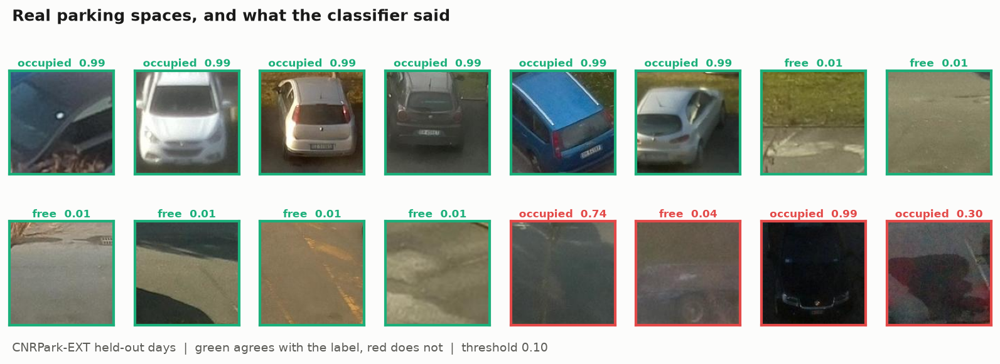

MobileNetV3 with ImageNet weights, 1.5 million parameters, six epochs, 824 MB of VRAM.

| | Held-out days | Held-out cameras |
|---|---:|---:|
| Test crops | 31,825 | 37,048 |
| Accuracy | **0.9976** | **0.9956** |
| Precision | 0.9986 | 0.9949 |
| Recall | 0.9973 | 0.9971 |
| AUC | 0.9996 | 0.9989 |
| False-free rate | **0.0014** | **0.0023** |
| Threshold | 0.10 | 0.24 |

The right column is the one that matters. Cameras 8 and 9 are held out entirely, so it is
answering about viewpoints it has never seen, which is the question that decides whether
this can be pointed at Amsterdam. Accuracy by weather on that split: overcast 0.9970,
sunny 0.9959, rainy 0.9913.

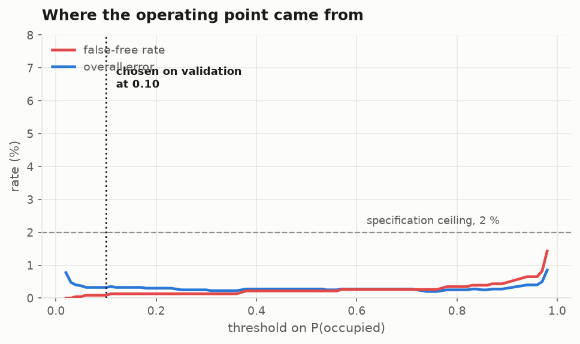

The threshold is part of the export rather than a constant in the worker. It was swept on
validation to hold the false-free rate under the 2 % ceiling, and weights shipped without
their operating point leave the worker guessing at 0.5, which is not the point anyone
measured.

Inference runs in C++ because it is on the clock: once per bay per frame, and a camera
over a street sees a few hundred bays. Crops go through one batched call rather than a
loop. Training stays in Python, where an extra minute costs nothing.

Verified across all three languages rather than assumed. PyTorch to ONNX agrees to
4.9e-07, and the same frame through the C++ path and the Python path agrees to 4.9e-07, so
the resampling matches too.

---

## The detector, which does not work

The other half of the vision work, kept here because the failure is the interesting part.

The first detector trained on rendered scenes: flat-shaded boxes standing in for cars, lit
by a fake sun. That buys exact ground truth, which is the only honest way to measure
gap-length error. It does not buy a street. The first real frame came back with two
motorcycles, one in a tree and one on empty pavement, and both police vans missing.

So I went and got real frames. `pf detect harvest` pulls them from feeds their operators
publish; I found 74 live Dutch streams and 69 of them gave up frames. A COCO-pretrained
Faster R-CNN labels them, which is far too heavy for the worker but runs once, offline.

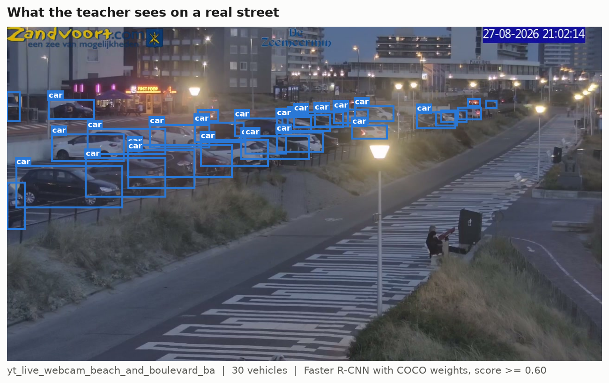

| | |
|---|---:|
| Cameras that produced frames | 69 |
| Real frames harvested | 704 |
| Teacher boxes | 2,491 |

Three things were wrong, in order of how much they cost me.

The evaluation applied sigmoid twice. `build_model` already sigmoids the heatmap inside
`forward()` and I sigmoided it again before decoding, which squashed every cell into the
0.50 to 0.73 band and turned the whole grid into detections. Precision read 0.004. The
per-class metric had its own bug and announced itself more loudly, reporting a recall of
7.495.

Nine cameras taught it nine streets. With the sigmoid fixed it hit 0.98 confidence on
cameras it trained on and 0.10 on two it had not seen. I assumed capacity and swapped the
322k from-scratch trunk for an ImageNet-pretrained MobileNetV3: precision on unseen
cameras went 0.200 to 0.500, recall stayed at 0.003, and dropping the threshold to 0.08
gave detections with zero true positives. The predictions were in the wrong places rather
than merely faint, which ruled out the backbone and left viewpoint diversity. Going from 9
cameras to 48 moved precision to 0.716 and recall to 0.111.

The cars are too small to see. That is where it still sits.

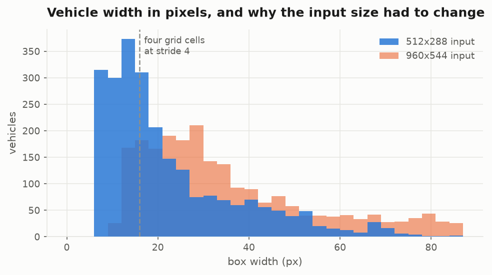

The final model trains on all 69 cameras and is held out against 12 of them, scoring
precision 0.120 and recall 0.014. That is worse than the 0.716 above and the difference is
the test set rather than the model: six city-street cameras versus twelve that add an
airport, two construction sites, a railway cam and a seaside promenade. Quoting the kinder
number would have been easy and would have been a lie.

The higher-resolution run is unfinished rather than disproven. 120 epochs at 960x544
reached loss 3.09 against 1.36 at the lower resolution and scored zero, which is what a
quarter of the updates spread over four times the grid cells looks like.

None of this reaches a driver. Occupancy served to users comes from operator feeds,
municipal sensors and the classifier above.

---

## Where the training data comes from

Everything the models learned from, and who to credit for it.

| Dataset | Used for | Size | Licence and source |
|---|---|---|---|
| **CNRPark-EXT** | The occupancy classifier, the model that works | 144,965 labelled crops, 9 cameras | Free for research. Amato et al., [cnrpark.it](http://cnrpark.it/) |
| **COCO** (via torchvision) | The teacher that labels real frames | 118k photographs, pretrained weights | CC BY 4.0. Lin et al., 2014 |
| **ImageNet** (via torchvision) | Pretrained trunks for both models | 1.2M photographs, pretrained weights | Deng et al., 2009 |
| **Live Dutch cameras** | 704 real frames for the detector | 69 feeds, operator-published | Watched as published, honoured robots.txt |
| **RDW open data** | Vehicle dimensions, 14-car test fleet | 4,862,118 passenger cars with height | Dutch vehicle register, open |
| **Amsterdam parkeervakken** | 210,247 surveyed bay polygons | Whole city, sign codes and time regimes | City of Amsterdam, open |
| **NDW, PDOK, OpenStreetMap** | Live occupancy, geocoding, points of interest | National | Open, each licence in `docs/data_sources/sources.md` |

Rendered scenes are still generated by this project's own renderer, and they earn their
place: they are the only source with exact ground-truth gap lengths, which is what makes
the 0.001 m gap MAE a measurement rather than a guess.

### Datasets I looked at and did not use

Checking these properly was worth the time, so the reasoning is written down.

**PKLot** (12,416 images, 3 lots) asks the same question as CNRPark-EXT and is a fine
dataset. CNRPark-EXT ships pre-cropped patches with official splits by day, camera and
weather, which is the protocol I wanted, so it won on convenience rather than quality.

**Surround-view parking-slot detection** ([CRPS-D / SS-PSD](https://arxiv.org/abs/2509.13133),
and the [panoramic PS2.0 work](https://pmc.ncbi.nlm.nih.gov/articles/PMC12568149/)) solves
a different geometry: fisheye cameras on a self-parking car looking down at the ground.
A fixed street camera 18 m up is not that, and the models do not transfer.

**Vehicle make and model recognition** (VMMRdb and similar) is the one I most wanted to
work, because knowing a parked car is a Volvo S60 would give its exact dimensions and let
the CV and the register check each other. It cannot work here, and the reason is a
measurement rather than an opinion: across 1,734 cars detected in the harvested frames the
median car is **39 pixels wide** in a native 1280x720 frame, and 71 % are under 64 pixels.
Fine-grained recognition needs a readable grille and badge. At 39 pixels nobody can tell an
S60 from an A4, so the honest ceiling is vehicle *class*, which the detector already
predicts and which maps to a dimension range rather than a number.

**Parking-lot demo repositories** ([one](https://github.com/8harath/Car-Parking-Detection),
[two](https://github.com/VisionPark/VisionParkDetect), [three](https://olgarose.github.io/ParkingLot/))
are applications rather than datasets. The second is a useful classical-CV baseline on
PKLot at 82 % to 97 % depending on lot and weather, which is the bar the classifier above
clears.

**Roboflow Universe** needs an API key, and its endpoints return 403 to an unauthenticated
client, so nothing from there is in this project.

**insecam** I will not use. It indexes cameras that are unsecured rather than published,
and nobody in those frames agreed to be in them. Every camera here is one its operator
broadcasts on purpose.

---

## The cameras

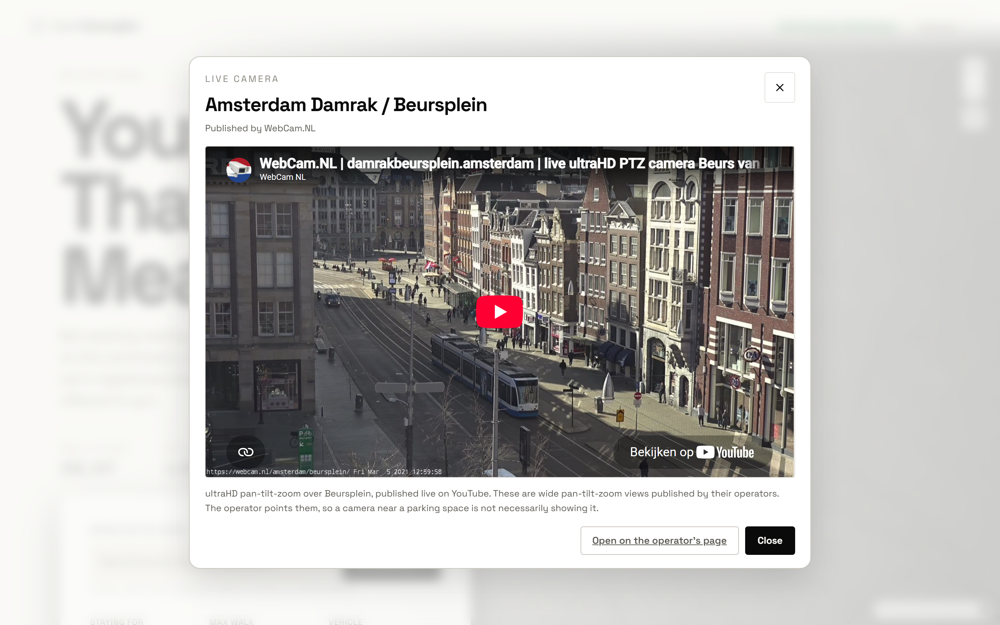

Every camera the vision pipeline may read is one you may watch. They sit on the map as
viewfinder markers, the same shape as the logo. A system that claims a bay is free on the
strength of a camera should be willing to show you the camera.

Opening one also shows what the vision pipeline currently sees, refreshed every two
seconds while you watch it.

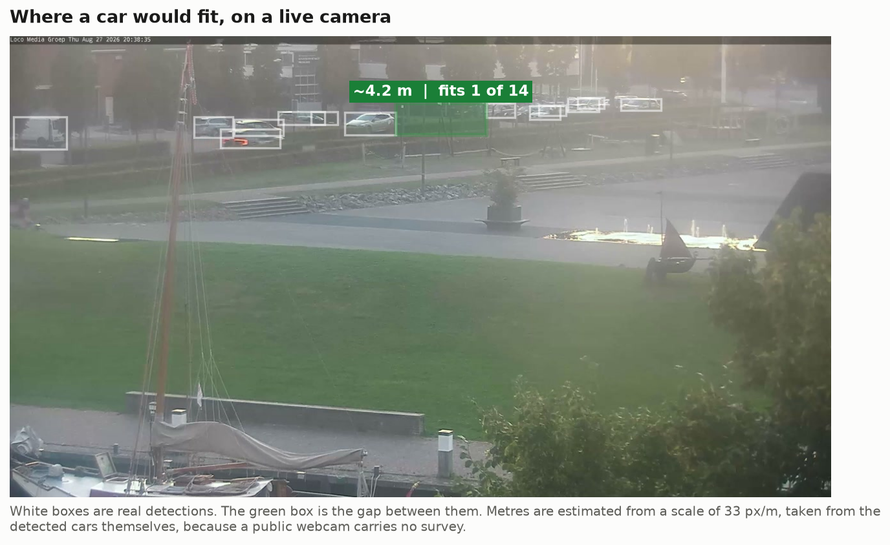

White boxes are real detections. The green box is the gap between two parked cars, and the
label says how many of the fourteen test vehicles clear it on length: a 4.2 m hole takes
the Fiat 500 and nothing else.

The metres are estimates and the interface says so. A public webcam carries no survey, so
the scale comes from the cars themselves, assuming a typical car is 1.80 m wide. Height
cannot be recovered from one uncalibrated view and is never reported. And an empty stretch
of kerb is not a legal space: whether you may park there lives in the sign code and the
time regime, which the search checks and the camera cannot see.

Three guards keep it from lying, each added after watching it get something wrong. A
candidate gap is discarded if any detected vehicle stands inside it, which stopped a row
of two dozen parked cars at Kijkduin being reported as one 22.4 m space. Anything longer
than 15 m is rejected as carriageway rather than parking, which stopped 37.6 m of open
road in Groningen being offered. And both flanks must be a motor vehicle, because the gap
between a leaning bicycle and a distant car is a pavement.

Two of the four feeds this file used to advertise are dead, so I went looking properly and
found 74 live Dutch streams, of which 10 verified fetchable on the first pass. Seven that
can be placed on a map are in the registry the search reads; a port terminal, a railway and
a waterway are real training footage and useless as "a camera near your bay", so they are
harvested from and left out. `pf cameras verify` re-checks rather than trusting the list,
because these are other people's cameras and they go down without telling anyone.

Getting frames at all took a detour. ffmpeg cannot complete a TLS handshake against
googlevideo from this machine and dies before any HTTP happens, while curl and urllib
manage it. So transport is split three ways: yt-dlp resolves the manifest, urllib fetches
the playlist and segments, and ffmpeg only ever opens a file already on disk.

The registry refuses by default. A feed nobody has assessed does not run, production
accepts only an explicit authorisation or an owner attestation, and "the robots file
allowed it" is not a licence. Frames are processed in memory and thrown away, only
occupancy, geometry, confidence and timestamps are published, and there is no face or
plate recognition anywhere.

---

## How it is put together

```
Web app  (Vite, TypeScript, MapLibre)
    |
FastAPI  search, ranking, vehicles, geocoding, cameras, availability stream
    |
    |-- parkfit_native (pybind11 -> C++)
    |      geo, spatial index, routing, fit engine, ranking, navigation links
    |-- SQLite by default, PostgreSQL and PostGIS when DATABASE_URL says so
    |-- ingest workers: RDW, NDW, PDOK, OSM, Amsterdam
                              ^
pf_cv_worker (C++)  ffmpeg -> health -> homography -> ONNX -> state machine
```

The split is on the clock, not on taste. Anything that runs per frame or per bay is C++:
geometry, the spatial index, routing, the fit engine, ranking, and the occupancy
classifier. Anything that runs once or on demand is Python: ingest, the API, training,
the CLI. Models cross the boundary as ONNX with a JSON sidecar carrying the input size and
the operating threshold, so retraining at a different resolution cannot silently start
feeding the graph wrongly scaled images.

The spatial grid answers a radius query over 250,000 bays in 93 µs. The same query as a
SQL bounding-box scan measured 200 ms warm and about four seconds cold, which is why the
grid is there.

Bay size comes from the polygon by pairing opposite edges. The enclosing rectangle does not
work: a Prinsengracht bay that is 5.66 by 2.61 m sits at 48°, and its enclosing rectangle
is 7.40 by 1.89 m, which matches neither dimension. Switching to edge pairs took usable
bays for a VW Polo from 40 % to 59.6 %.

Mirrors and bodywork are tracked separately, because mirrors hang over the painted line
into airspace that is nobody's bay. Parallel kerb bays get NEN 2443 parallel clearances
instead of perpendicular ones: the median Amsterdam kerb bay is 1.96 m and a Polo is 1.75 m
wide, so asking for 25 cm of lateral margin rejects an ordinary car by four centimetres.

Two more things that only turned up by looking. The national geocoder cannot find
"Rembrandthuis", because PDOK indexes the address register rather than places, so the
geocoder is hybrid: OSM points of interest first, addresses second, and 18 of 18 real
destination names resolve. And polling slowly wrecks the decay-rate estimate: a free space
on a busy centre street lasts about five minutes, so fifteen-minute polling recovers 70 %
of the true rate and thirty-minute polling 52 %, because a turnover that starts and
finishes between two samples never happened as far as you can tell.

---

## Where every number comes from

Every response carries its source and how old it is. Sources are ranked and never
overwrite each other: operator feed, then camera, then municipal sensor, then user report,
then model, then the static register. Every observation is kept, and disagreements get
resolved on read.

If a live source's last observation is older than the staleness window, it stops counting
as live and gets labelled stale. I would rather show a stale label than a confident wrong
number.

---

## Take me there

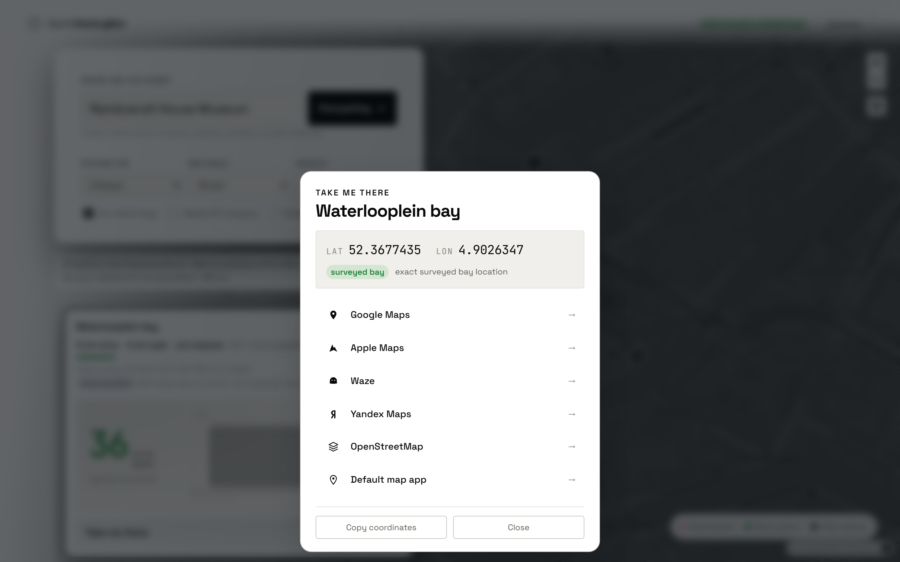

Tapping a result hands the space to Google Maps, Apple Maps, Waze, Yandex, OpenStreetMap
or whatever the device registers for `geo:` URIs, as coordinates rather than an address. A
street string gets re-geocoded by the receiving app against its own database, which lands
you near the place instead of on it. Coordinates go over at seven decimal places, about a
centimetre, so the format is never the limiting factor.

For a car park the destination is the entrance where one is recorded, and the interface
says which point it used. Routing to a garage centroid drops you inside a building outline
and you still have to find the ramp.

---

## The interface

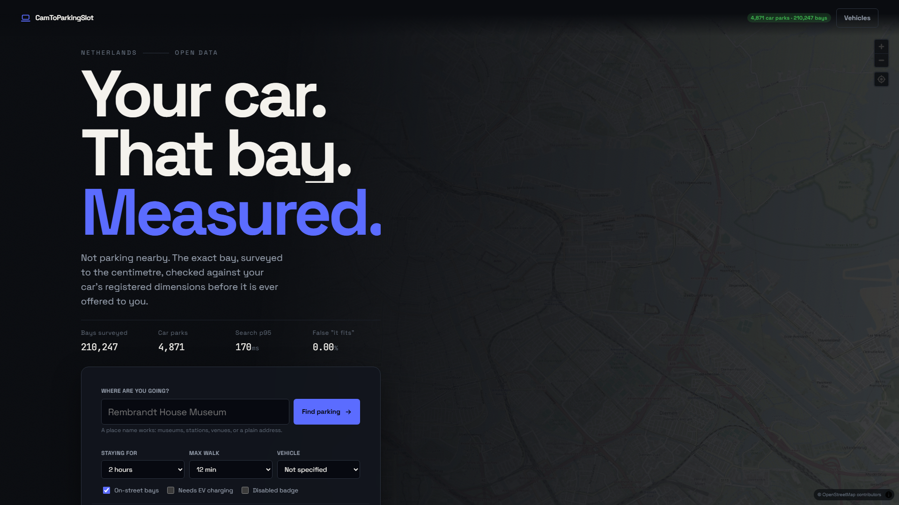

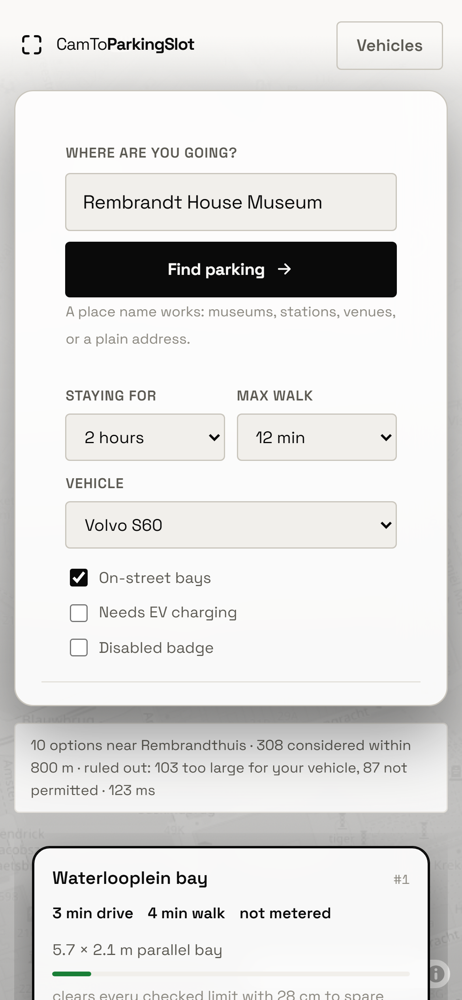

Checked at 320, 390, 412, 768, 1024, 1440, 1920 and 2560 pixels wide, plus landscape
phones. Three things actually broke. At 320 px the page overflowed, because the status pill
and the Vehicles button will not share a row. The search field collapsed to 50 px beside
its own submit button. And a 568 px-tall viewport could not hold the headline and the
console at once, so on short screens the supporting copy goes and the console stays.

The palette comes from the brand mark and nothing else: four corner brackets, a viewfinder,
near-black on off-white. It carries no colour, so neither does the interface. The one place
colour survives is where it carries information, because a driver reads a fit verdict off
the colour before reading the words.

---

## Running it the long way

You need git, Python 3.12+, Node 20+, ffmpeg, and a C++20 compiler (MSVC Build Tools on
Windows, gcc or clang elsewhere). CMake and Ninja come bundled with the VS Build Tools; on
Linux and macOS install them from your package manager.

```bash
git clone https://github.com/Coflazo/CamToParkingSlot.git
cd CamToParkingSlot
```

Dependencies are managed with [uv](https://docs.astral.sh/uv/):

```bash
# macOS and Linux
curl -LsSf https://astral.sh/uv/install.sh | sh

# Windows PowerShell
powershell -c "irm https://astral.sh/uv/install.ps1 | iex"
```

Then, on any platform:

```bash
uv sync --all-extras
cmake -S . -B build -DCMAKE_BUILD_TYPE=Release && cmake --build build -j
uv run pytest tests -q

uv run pf ingest all                                  # pull the open data
uv run pf search "Rembrandt House Museum" --duration 120
uv run pf evaluate                                    # the metric table above
```

On Windows `.\tasks.ps1 setup`, `build` and `test` do the same three steps.

The web app needs two terminals, because each command blocks:

```bash
uv run uvicorn parkfit.api.app:app --host 127.0.0.1 --port 8000   # terminal 1
cd web && npm install && npm run dev                              # terminal 2
```

Then open http://127.0.0.1:5173. API docs are at http://127.0.0.1:8000/docs. The first
search takes about four seconds while the 188,715-node road graph and the spatial index
load; every search after that is around 200 ms.

### Add a car, or you will not see the interesting part

Search works signed out, but the fit diagram is the whole point and it needs to know what
you drive. Vehicles belong to an account:

1. Press **Vehicles**, top right.
2. Register with any email and password. It is your machine and your database.
3. Add a car. `uv run pf cars` prints the fourteen test vehicles with their real RDW
   dimensions: the Volvo S60 is 460 by 180 by 143 cm and 1566 kg.
4. Search again and pick it in the **Vehicle** dropdown.

The status line changes the moment a car is selected. Without one it says how many options
it found; with one it says how many it threw away and why.

### The machine learning

```bash
uv run pf occupancy stats                  # what CNRPark-EXT is on disk
uv run pf occupancy train                  # the classifier, official day split
uv run pf occupancy train --protocol camera --holdout camera8,camera9

uv run pf detect harvest                   # real frames from every live camera
uv run pf detect label                     # teacher labels
uv run pf detect train-real                # the student
uv run pf detect export-real               # ONNX plus the C++ sidecar

uv run pf predict all                      # occupancy history, decay rates, model
uv run jupyter lab notebooks/              # the same pipelines, visual, step by step
```

Training used a laptop RTX 4050: 824 MB of VRAM and about three minutes for the
classifier. Compute was never the constraint here, data diversity was, so nothing needed a
rented GPU.

---

## Why I piloted in NL

A friend drove over from Belgium to visit me at my dorm and could not find anywhere to
park. He did not know how few spaces there are here, so he took the first one he saw,
which turned out to be a thirty-minute walk away. That evening is the whole product.

Then I read into it and found the scarcity is deliberate. Dutch cities cap parking on
purpose: fewer spaces, priced higher, makes driving the inconvenient option, and the room
and the money go into buses, trams and bike lanes instead. It works because the
alternatives are genuinely good, so giving up the car costs you very little. Other cities
have different transport, infrastructure and policy contexts. Istanbul sits at the top of
the table below and may benefit from a project like this as well: making existing parking
capacity easier to understand and navigate could reduce unnecessary searching while
complementing the city's broader mobility priorities.

So this is not a campaign for more asphalt. If parking is going to be hard on purpose,
the least a driver deserves is to know before setting off which spaces their car actually
fits.

The reason I built it here rather than anywhere else is data, not need. Amsterdam publishes all 210,247 parking bays as surveyed
polygons with sign codes and time regimes. RDW publishes registered dimensions per plate,
including height for 4,862,118 passenger cars. NDW publishes live occupancy. Almost nowhere
else can you check a specific car against a specific bay without doing the survey yourself
first.

So the Netherlands is where the idea is provable, and the table below is where it would
matter more. Amsterdam sits at roughly one car per on-street bay. Istanbul sits at five and
a half.

### Cars per parking space, biggest city of each country

Ranked on registered vehicles divided by parking spaces open to the public in that
country's largest city. Higher is worse. Every row says what its denominator actually
counts, because that varies by city and it is the part that makes these numbers hard to
compare. Sources are numbered against the reference list at the end.

| # | Country or territory | City | Vehicles | Spaces | Vehicles per space | What the denominator counts | Src |
|--:|---|---|--:|--:|--:|---|:--|
| 1 | Turkey | Istanbul | 6,292,611 | 1,143,937 | **5.50** | All non-residential parking: municipal, hospital, shopping centre, private operators | [1] |
| 2 | United Kingdom | London | ~3,100,000 | ~1,000,000 | **~3.1** | Regulated on-street only, so this is an overstatement | [2] |
| 3 | France | Paris | 617,000 | 220,000 | **2.80** | On-street plus public car parks | [3] |
| 4 | China | Beijing | 4,400,000 | 1,930,000 | **2.28** | All parking counted in the THUPDi survey | [4] |
| 5 | Russia | Moscow | ~4,000,000 | 1,900,000 | **~2.11** | Registered parking spaces citywide | [5] |
| 6 | India | Mumbai (south) | 354,000 | 190,000 to 220,000 | **~1.73** | Estimated total capacity, south Mumbai only | [6] |
| 7 | **Netherlands** | **Amsterdam** | **220,000** | **210,247** | **1.05** | **On-street bays, from the city's own polygon register** | **[7][8]** |
| 8 | Germany | Berlin | 1,240,000 | 1,276,312 | **0.97** | On-street, counted by survey vehicle | [9] |
| 9 | South Korea | Seoul | not published | not published | **0.83** | Official parking supply rate of 120.7 % | [10] |
| 10 | Japan | Tokyo (23 wards) | not published | not published | **<1** | Spaces rose 24 % while registrations fell 9 % over a decade | [11] |

London ranks second on a denominator that counts only regulated kerbside, so its true
figure is lower than Paris's. I left it in the position the published numbers give it and
flagged it rather than quietly adjusting it.

### The other ten, where the ratio is not published

I could not find a city-wide vehicles-per-space figure for these from a source I trust, so
they are listed alphabetically with what is actually documented. Filling the gap with an
estimate would defeat the point of the table.

| Country or territory | City | What is documented | Src |
|---|---|---|:--|
| Brazil | São Paulo | Parking minimums abolished citywide in 2014; fleet about 6 million | [12] |
| Egypt | Cairo | Chronic shortage described in the planning literature, no city inventory published | [13] |
| Hong Kong | Hong Kong | Over 800,000 spaces as of June 2025; the Bureau reports the ratio improving without publishing it | [14] |
| Italy | Rome | 26 metered spaces per 1,000 residents; Milan short 89,000 daytime spaces | [15][16] |
| Mexico | Mexico City | 73 % of drivers had abandoned a parking search in the previous 12 months | [17] |
| Nigeria | Lagos | Office buildings documented as under-provisioned, no city inventory published | [18] |
| Poland | Warsaw | Over 2 million registered cars; up to 17,000 on-street spaces projected lost by 2040 | [19] |
| Spain | Madrid | Up to 41,000 on-street spaces projected lost to growing car sizes by 2040 | [19] |
| United States | New York | 107 hours per driver per year spent searching, the highest INRIX measured anywhere | [20] |
| Vietnam | Ho Chi Minh City | Built parking land is 2.69 ha against the 550 ha planned for static traffic | [21] |

One thing that showed up across nearly every source: cars are getting wider faster than
kerbs are. New cars gain about 1.2 cm of length a year, and Transport & Environment project
European cities losing 8.5 % to 14 % of on-street parking by 2040 for that reason alone
[19]. A bay that fitted the car parked in it in 2005 does not necessarily fit its
replacement, which is the entire premise of this project.

Next stages go to the countries at the top of the first table. Turkey first, since Istanbul
has both the highest ratio I found and an open municipal parking dataset, then the
UK and France.

### References

[1] Anadolu Ajansı. (2026). *İstanbul'da her 6 araca yaklaşık bir park yeri düşüyor*. https://www.aa.com.tr/tr/gundem/istanbulda-her-6-araca-yaklasik-bir-park-yeri-dusuyor/3890310

[2] Centre for London. (n.d.). *Car ownership, use and parking in London*. https://centreforlondon.org/reader/parking-kerbside-mangement/chapter-1/

[3] Paris ZigZag. (n.d.). *Les chiffres fous des transports parisiens*. https://www.pariszigzag.fr/paris-au-quotidien/les-chiffres-fous-des-transports-parisiens/

[4] CGTN. (n.d.). *Report shows extreme shortage of parking spaces in China's megacities*. https://news.cgtn.com/news/3d67544e7a49444e/share.html

[5] Global Highways. (n.d.). *Huge programme to develop parking infrastructure in Moscow being introduced*. https://www.globalhighways.com/news/huge-programme-develop-parking-infrastructure-moscow-being-introduced

[6] Government of Maharashtra. (2025). *Maharashtra proof of parking policy: Concept note and discussion paper*. https://cdnbbsr.s3waas.gov.in/s3a012869311d64a44b5a0d567cd20de04/uploads/2025/05/20250501170274283.pdf

[7] Gemeente Amsterdam, Onderzoek en Statistiek. (2024). *Verkeer in cijfers 2024*. https://onderzoek.amsterdam.nl/artikel/verkeer-in-cijfers-2024

[8] Gemeente Amsterdam. (2026). *Parkeervakken* [Data set]. https://api.data.amsterdam.nl/v1/parkeervakken/

[9] Tagesspiegel. (n.d.). *Autostellplätze auf den Straßen gezählt: In Berlin gibt es mehr Parkplätze als Autos*. https://www.tagesspiegel.de/berlin/autostellplatze-auf-den-strassen-gezahlt-in-berlin-gibt-es-mehr-parkplatze-als-autos-12663416.html

[10] Seoul Metropolitan Government. (n.d.). *주차 관련 통계* [Parking statistics]. https://news.seoul.go.kr/traffic/archives/314

[11] Inquirer Business. (n.d.). *Rules for Tokyo parking lots to ease as car ownership falls*. https://business.inquirer.net/286011/rules-for-tokyo-parking-lots-to-ease-as-car-ownership-falls

[12] Parking Reform Atlas. (n.d.). *São Paulo parking minimums abolition*. https://www.parkingreformatlas.org/parking-reform-cases-1/s%C3%A3o-paulo-parking-minimums-abolition

[13] Ibrahim, A. (2022). *Toward solving the car parking issue for Egyptian cities*. https://www.researchgate.net/publication/360604045_Toward_Solving_the_Car_Parking_Issue_For_Egyptian_Cities

[14] Transport and Logistics Bureau. (2025, June 11). *LCQ6: Supply of car parking spaces*. https://www.tlb.gov.hk/eng/legislative/transport/replies/2025/20250611c.html

[15] News Minimalist. (n.d.). *Rome struggles with too many cars and too few parking spaces*. https://www.newsminimalist.com/articles/rome-struggles-with-too-many-cars-and-too-few-parking-spaces-ad71fe0b

[16] Mobility Management Consulting. (2023). *Il futuro piano parcheggi di Milano*. https://www.mobilitymanagement.consulting/il-futuro-piano-parcheggi-di-milano/

[17] Wikipedia contributors. (n.d.). *Parking in Mexico City*. https://en.wikipedia.org/wiki/Parking_in_Mexico_City

[18] Estate Intel. (n.d.). *Analysis of parking provision in Lagos' office buildings*. https://estateintel.com/news/lagos-parking-nightmare-whats-next

[19] Transport & Environment, & Clean Cities. (2026). *'Carspreading' to wipe out up to 14% of on-street parking in European cities*. https://cleancitiescampaign.org/carspreading-to-wipe-out-up-to-14-of-on-street-parking-in-european-cities-study/

[20] INRIX. (2017). *Searching for parking costs Americans $73 billion a year*. https://inrix.com/press-releases/parking-pain-us/

[21] VietnamNet. (n.d.). *HCMC faces tremendous pressure on parking spaces*. https://vietnamnet.vn/en/hcmc-faces-tremendous-pressure-on-parking-spaces-2077838.html

---

## Stack

C++20, Python 3.12, TypeScript.

FastAPI, SQLAlchemy 2.0, pybind11. PyTorch to ONNX Runtime, LightGBM, torchvision.
Vite and MapLibre. SQLite by default, PostgreSQL and PostGIS optionally. No OpenCV: the
homography, the Jacobi eigensolver, the RANSAC and the perceptual hashing are written
here.

194 Python tests, 8 C++ suites. Data from RDW, NDW, PDOK, OpenStreetMap, the City of
Amsterdam and CNRPark-EXT, each licence recorded in `docs/data_sources/sources.md`.
