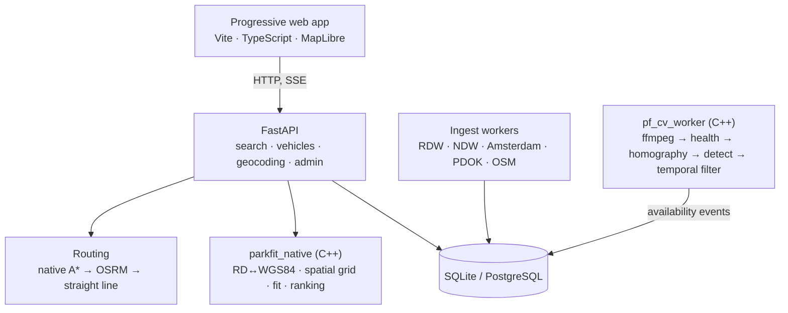

# Architecture

How the pieces fit, and — more usefully — why each one is shaped the way it is. Every
"why" here is a decision that was made for a reason and could reasonably have gone the
other way.

---

## The shape of the system



Three tiers of degradation run throughout: **native C++ → optional container → analytic
fallback**. The system always answers, and always says which tier answered, so the
ranking can discount an estimate against a measurement.

---

## Why the work is split between C++ and Python

Python owns orchestration, I/O, and anything that talks to a network or a database. C++
owns the arithmetic that runs *per candidate, per search*.

That is not a performance affectation. A single search touches a few hundred candidates
and each needs a coordinate transform, a fit verdict and a score. Putting that in C++ is
what lets radius search happen in-process instead of in PostGIS, and the ranking be a
pure function instead of a service call — which is why the whole product runs on a laptop
with no containers.

The boundary is enforced by tests: `tests/unit/test_geometry.py::TestNativeParity`
asserts the two implementations agree bit-for-bit on bay measurement. A bay's verdict
must not depend on whether the project happened to be compiled.

---

## Search, in eleven ordered steps

1. Geocode the destination (OSM points of interest, then PDOK)
2. Retrieve candidates within an expanding radius — via the in-memory spatial grid
3. Merge cross-source duplicates
4. Drop what is **illegal** for this driver at this time
5. Drop what this vehicle physically **cannot use**
6. Route the drive leg — one sweep for all candidates
7. Route the walk leg — one sweep for all candidates
8. Resolve current availability by source priority
9. Estimate price for the intended duration
10. Score by expected total inconvenience, and diversify
11. Record what was recommended, for anti-herding

**The order is the design.** Legality and fit come before routing because they are cheap
and eliminate most candidates, and routing is the expensive step. Availability is
resolved after fit, because there is no point asking whether a space is free in a garage
the vehicle cannot enter.

### Why routing is two sweeps rather than N routes

A parking search is not N point-to-point queries. It is **two one-to-many** queries:
drive time from one origin to many entrances, and walk time from many exits to one
destination. Running A* per candidate re-explores the same city several hundred times, at
roughly 30 ms each.

One capped Dijkstra per leg labels every reachable node in a single sweep: 400 drive legs
in 557 ms instead of 8.5 seconds. The cap matters as much as the sweep — without it the
search settles the entire graph, including places no driver would consider.

### Why radius search is not a database query

A `lat BETWEEN … AND lon BETWEEN …` predicate can only range-scan on the leading index
column, so the database narrows on latitude and then filters tens of thousands of bays by
longitude. Measured: 200 ms with a warm page cache, **four seconds with a cold one** — and
every fresh connection is cold.

The C++ grid answers the same question over 210,000 bays in microseconds and returns ids,
turning a 30,000-row scan into a handful of primary-key lookups.

---

## The ranking model

Rank by expected total inconvenience, not by distance. A free kerb space 200 m away that
will probably be gone in four minutes is worse than a guaranteed garage 600 m away, and a
ranking built on metres cannot express that.

```
E[T] = T_drive + w·T_walk + (1 − P_eta)·T_failure
G    = v_t·E[T] + C_parking + R_fit + R_uncertainty
P_eta = P_now · e^(−λt)
```

- **λ** is the rate at which a visible vacancy disappears, estimated per street segment,
  weekday and 15-minute bucket. The exponential is a memoryless assumption, which is a
  simplification — a space free at 03:00 is far more durable than one free at 17:30 — and
  that is exactly why λ is not a single global constant.
- **T_failure** is 14 minutes. A failed recommendation is not just the wasted approach:
  you arrive, find it gone, re-enter traffic and restart the search, typically in the
  busiest part of the city. Set too low, the ranking gambles on long-shot kerb spaces.
- **Anti-herding** decays a space's probability for each other live recommendation
  pointing at it. Without it the app manufactures its own congestion by sending everyone
  to the one space it can see.
- **Diversification** caps results per street. Three kerb gaps on one street share a
  single failure mode; forcing variety means the backup fails independently of the primary.

---

## The evidence layer

Several sources describe the same car park and routinely disagree. Two rules govern it:

**Source priority is fixed and ordered.** Operator feed > camera > municipal sensor >
user report > model > static register > OSM. Never overwrite: every observation is kept
and the current state is resolved on read. Overwriting would destroy the audit trail that
answers the only question that matters after a bad recommendation — *which source told us
that, and when*.

**Freshness is a first-class property.** A live source whose last observation is older
than the staleness window stops being a live source and is presented as stale. Showing a
five-minute-old count as current is how a parking app teaches its users not to trust it.

When nothing has been observed, the answer is a **base rate**, not a shrug — and not a
zero. Zero would rank a car park we have no reading for below one we know to be full,
which is backwards. A metered kerb bay in a Dutch city centre is occupied most of the
day, so its prior is 0.15; a garage has many interchangeable spaces, so its prior is 0.62.

---

## The vision pipeline

```
ffmpeg → frame health → homography → detector → ground projection
       → kerb intervals → temporal filter → availability event
```

**Frames arrive through an ffmpeg subprocess** rather than linked libav. ffmpeg already
speaks HLS, RTSP, MJPEG and DASH, it is already installed, and a codec fault in a separate
process cannot take down the worker.

**Sampling is deliberately slow** — one frame every eight seconds. Parking changes over
minutes; there is nothing in a 25 fps stream that 0.125 fps does not capture. Slow
sampling is also a privacy control: it directly reduces how much imagery of a public
street exists at any moment.

**Health checks gate everything.** A camera that has frozen, gone dark, been rained on or
been knocked out of alignment still produces frames — it just produces frames that mean
nothing. Nothing is published until the frame has been shown to be worth believing.

**Only the bottom edge of a detection is projected.** That edge is where the vehicle meets
the ground, and the homography maps the ground plane and nothing else. Projecting the box
centre — which floats at roughly half the vehicle height — places every car metres further
from the camera than it is, with the error growing with distance.

**Gap measurement is geometric, not learned.** A detector says "there is a car roughly
here"; everything that turns that into "5.8 m of free kerb" is projection and interval
arithmetic, which can be tested against exact ground truth. Asking a network to regress
gap length directly would be harder to train and impossible to audit when wrong.

### The temporal filter, and why it is asymmetric

Telling a driver a space is occupied when it is free costs them one option out of ten.
Telling them a space is free when it is occupied costs them the trip. The two errors are
not remotely equal, so the transitions are not symmetric:

- **OCCUPIED** on a single confident detection — that direction is the safe one
- **VACANT** only when three of the last four observations are clean *and* the latest is
- **UNKNOWN** the instant anything is wrong, and never held back

UNKNOWN is a first-class answer. A broken camera should say so, and the ranking falls
back to a predictive estimate. Continuing to publish the last good state is how a vision
system tells a confident lie.

The window tolerates one outlier rather than demanding a strict run, and that is a
measured decision: a strictly-consecutive rule makes the published state depend entirely
on the last three frames, which caps recall at (1 − false-alarm rate)³ — 83 % at a 6 %
false-alarm rate — no matter how long the camera has been watching. Tolerating one
outlier lifts recall to 92 % while false-free rises only to 0.65 %.

---

## Storage

Geometry is stored **portably**, not in PostGIS types: points as indexed `lat`/`lon`
floats, polygons as GeoJSON text. The same schema runs on SQLite and PostgreSQL. Radius
search does not need a database index at all, so PostGIS becomes an optional accelerator
for ad-hoc spatial SQL rather than a hard dependency that stops the product running.

Bay polygons are stored in **RD New metres** and all metric work happens there. RD is a
conformal metric projection, so a length measured in it is a true length. Converting to
WGS84 first would fold both the ~0.23 m datum offset and cosine-latitude distortion into
the very number that decides whether a car fits.

`availability_observations` is append-only. Recommendations are buffered in memory and
flushed in the background, because a response should never block on bookkeeping it does
not depend on.

---

## Trade-offs taken deliberately

| Decision | Cost | Why |
|---|---|---|
| SQLite by default | No concurrent writers at scale | Runs with zero setup; PostgreSQL is one env var away |
| Own routing engine | Less sophisticated than OSRM | No Docker, no 1.5 GB extract, no 20-minute preprocessing |
| Spherical haversine | 0.13 % short vs the ellipsoid | Metres over the radii searched; branch-free and cheap |
| Kadaster RD polynomial in C++ | 0.23 m vs the rigorous grid | Systematic, so it cancels out of every length measurement |
| ffmpeg subprocess | A pipe and a process per camera | Every container format for free; codec faults are isolated |
| Conservative bay measurement | Some usable bays reported smaller | An error must point away from "your car fits" |
| Three confirmations for vacancy | ~24 s latency, ~8 % recall cost | Buys a 0.65 % false-free rate |
| No anti-bot evasion | Some sources unreachable | Circumventing an access control is a different act, and it breaks constantly |
